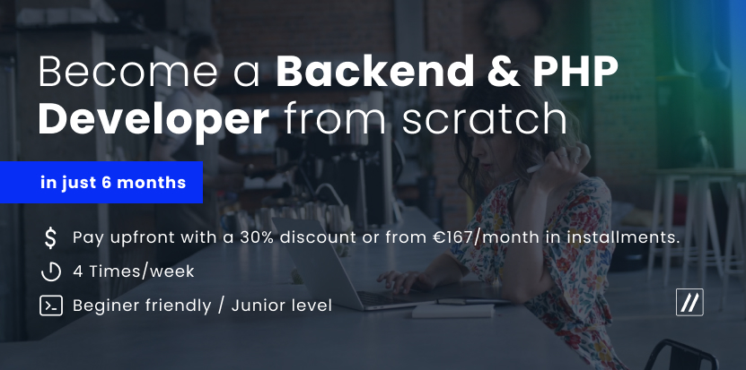
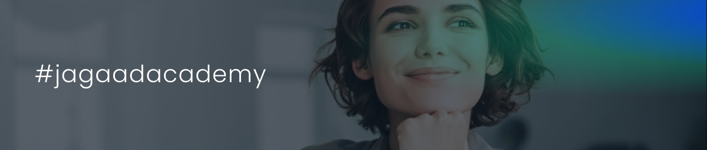

<h4 align="center"> <a href="#">Documentation</a>  <a href="#">FAQs</a>  <a href="#">Community</a> <a href="#">Privacy policy</a> </h4>
<h3 align="center">Start your tech career with Jagaad Academy!</h3>
<h4 align="center"><a href="https://academy.jagaad.com/course/php-backend-development/">Become a developer in 24 weeks with in a fully remote academy.</a></h4>
<h3 align="center">Follow us on: <a href="https://www.instagram.com/academyjagaad/">Instagram</a> | <a href="https://www.facebook.com/JagaadAcademy">Facebook</a> | <a href="https://www.linkedin.com/school/jagaad-academy/">Linkedin</a></h3>

# Summary

Our mission is to grow the biggest community of companies and IT talents, so we teach software development courses and we also tailor B2B programs to update corporate team skills in IT.  

We teach our students how to build dynamic web applications using HTML, CSS, and TypeScript: everything they need to know for developing interfaces.

## After graduation students will be able to:

- Write PHP code in the right way by learning the most popular server-side programming language
- To understand web services solutions, we will learn about communication between applications and how to create a Web API using the REST architectural style.
- Understand the web ecosystem, protocol, client and server-side applications
- Set-up your developer environment to be prepared to join a company as a junior backend developer

# Why joining Jagaad Academy?

Our courses focus on teaching you the best tech-stacks, but you will also gain skills such in teamwork, problem-solving, leadership, and more.  

**Our team of 50+ developers is spread around the world.**

## Perks and advantages

- Pay when you get a job
- Hiring opportunities
- Learn the most in-demand skills
- Great career progression and salary
- HR assistance

# Community

The development. It's for those who want a proper, well-rounded grounding in concepts fundamental to all computing disciplines, and for those who have the discipline, will, and (most importantly!) good habits to obtain this education largely on their own, but with support from a worldwide community of fellow learners.

**[Instagram](https://www.instagram.com/academyjagaad/)  / [Facebook](https://www.facebook.com/JagaadAcademy) / [Linkedin](https://www.linkedin.com/school/jagaad-academy/)**

# Frequently Asked Questions - [All FAQs](https://academy.jagaad.com/faq/)

Here you can find some of the most asked questions, however for a full list of questions please access our website.

## Do you have free courses that I can access?

Our free courses are totally free, and they don’t require you to enroll in our full-time course. You can follow them whenever you prefer! Please access here: [https://academy.jagaad.com/free-courses/](https://academy.jagaad.com/free-courses/)

## How much do the courses cost?

We teach our courses through a “study now, pay later” format. You will only need to pay for course once you find a job in the IT industry. And within 18 months from your graduation date, you will receive our assistance in helping you find a job.

- 6 months courses cost €3000
- We offer the possibility to pay monthly fees of €149.50 euro for 20 months
- You can also pay everything in one installment

## Will I be supported in looking for a new job after the course?

Of course!During the course you will have a dedicated module were will assist you in interview preparation, LinkedIn profile optimization and CV creation. You will just need to follow these steps when applying for a job.After graduation, the best performers will be invited to work for Jagaad. We will also contact graduates with our IT partner companies who are willing to hire new profiles.

# What will I learn? - BE

These are just some Tech/Topics you will learn:

- Syntax
- Types
- Control-flow structures
- Functions and operators
- Object-oriented PHP programming
- Code design
- Relational Database
- Git
- Composer
- PSRs
- Web services
- Tests
- Errors & Debugging
- Framework Introduction
- Object Relational Mapper
- Design Patterns
- Symfony Basics

# Become a coach

We're looking for people we can pay to create full-length Scrimba courses. If you're interested, please access our website and fill the form or send us a direct message explaining why youw ant to become a coach with us and the area of expertise.

## Prerequisites to become a coach

- More than 5+ years of experience on a given topic
- Taste for adventure and teach new bright minds
- Always ready to help and make things easier for the students and guide them along the process

# Contact us

You can contact us directly on [LinkedIn](https://www.linkedin.com/school/jagaad-academy/) or on [Facebook](https://www.facebook.com/JagaadAcademy). We also have a live chat on our website through Facebook messenger to make things even easier.  

If you want to write us you can also do it here:  
[academy@jagaad.com](mailto:academy@jagaad.com)

# Privacy policy

We don’t want to bother you with these things, but they must be present.  
Please check all details on our website: [https://academy.jagaad.com/privacy/](https://academy.jagaad.com/privacy/)
